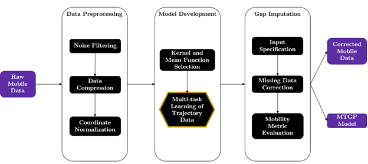
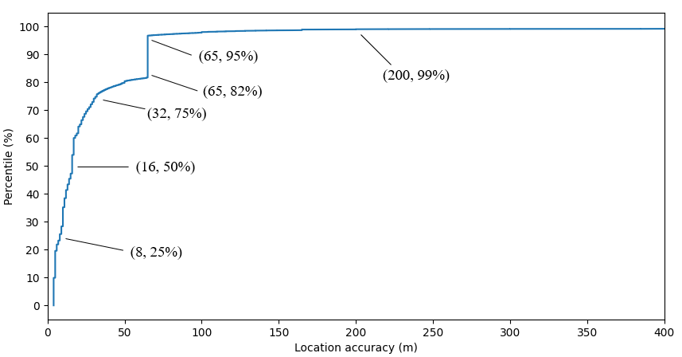
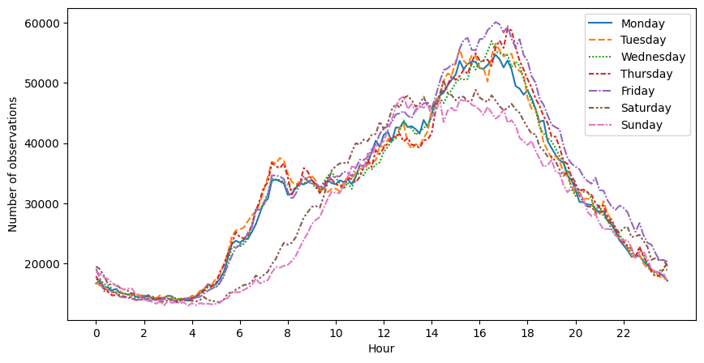
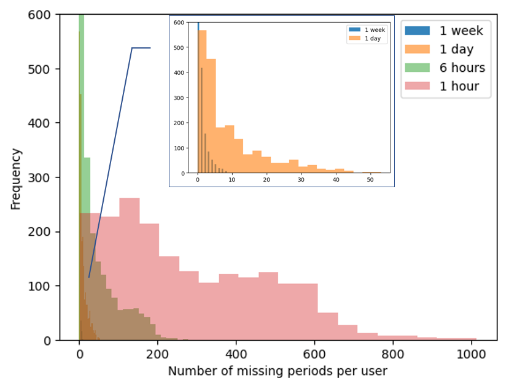
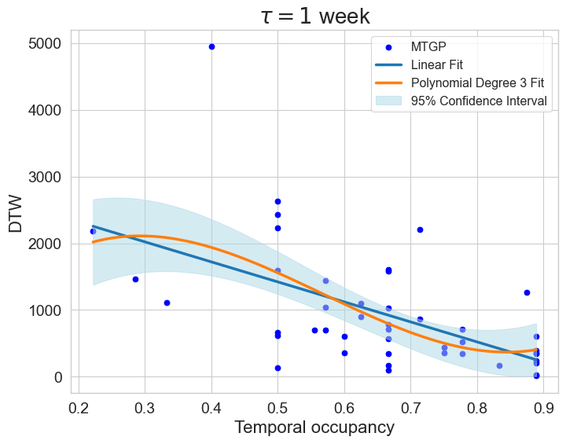
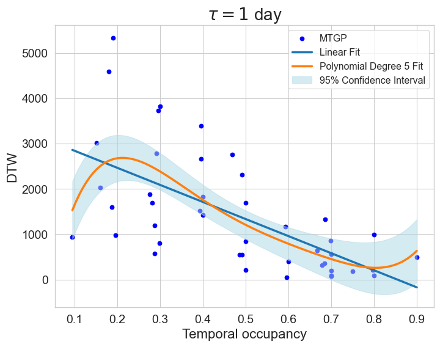
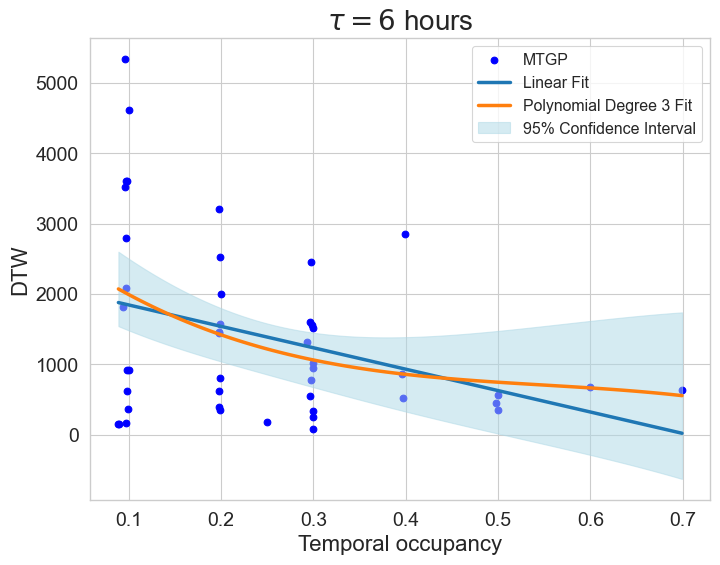
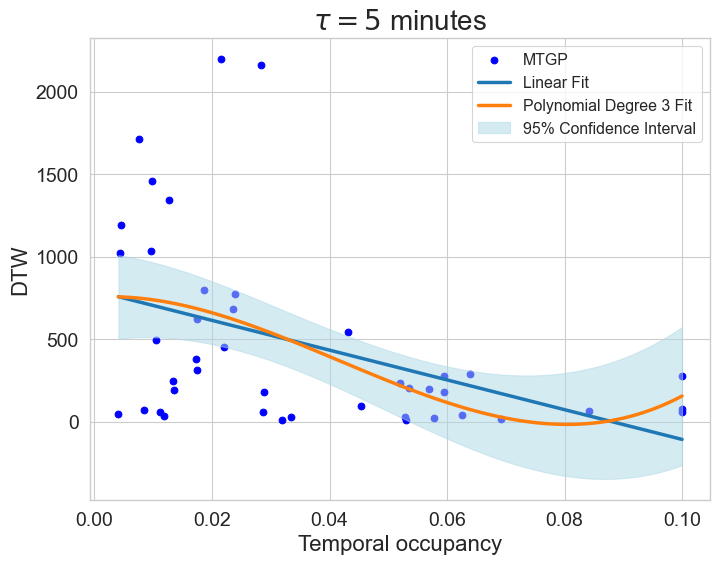

[](https://mybinder.org/v2/gh/ekinugurel/GPSImpute/master)

## About
GPSImpute is a library to impute missing values for mobile datasets, largely in the context of human mobility. It uses multi-task Gaussian processes to infer missing GPS traces. In practice, for short gaps in continuous coverage, our method is comparable to existing smoothing techniques. For long gaps, however, our method cleverly takes advantage of an individual's longitudinal data to predict missing segments.



## Descriptive Data Analysis
<!--  -->

<!--  -->





## Installation
```
$ git clone https://github.com/ekinugurel/GPSImpute.git
$ cd ./GPSImpute
$ pip install -e .
```
## Model Inputs


## Usage
#### Initialization Strategy & Parameter Optimization
The optimization problem of a GP is non-convex. Therefore, kernel parameter initialization can help avoid bad local optima, leading to better model estimation and more accurate prediction results. We achieve this in two ways. First, if the gap is short enough, we take advantage of training points near the gap to infer trip characteristics. These include metrics like average velocity, total distance traveled, trip duration, and stop rate, among others. Our first set of experiments suggest that trips with differing characteristics tend to land at different optimal parameters. Therefore, we suggest initializing the lengthscale parameter of continuous temporal dimensions (Unix time in our case) according to the characteristics of the trip with missing data. 

If using a monotonically-increasing temporal dimension as an input, one alternative we have identified is to initialize the lengthscale parameter with the average length of gap between observations in the training data. Ak et al. (2018) employed this strategy without any optimization. We however do further optimize the parameter beyond this initial heuristic using the Adaptive Moment Estimation algorithm (Kingma and Ba, 2017), a preferred choice among various machine learning frameworks due to its computational efficiency and ability to manage sparse gradients on noisy data.

We initialize binary variables (i.e., one-of-k encoded categorical variables) with a lengthscale of 1. This is largely done to avoid model misspecification during the optimization stage as lengthscale parameters are constrained to be nonnegative. In our implementation, a small amount of noise (called jitter) is added to the diagonal of the covariance matrix. This is done to ensure numerical stability when performing matrix operations like inversion and decomposition. Simultaneously, however, jitter can lead to parameter values dipping below 0 at the very first iteration of the optimization algorithm---if the learning rate is small, the first iteration of the optimization algorithm may result in a value that is very close to 0, and the associated jitter may cause the parameter to flip signs.


## Results





## Licensing
See the [LICENSE](LICENSE) file for licensing information as it pertains to files in this repository.

## Contact
Ekin Uğurel (ugurel [at] uw.edu)
